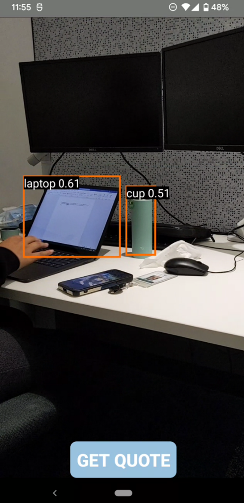
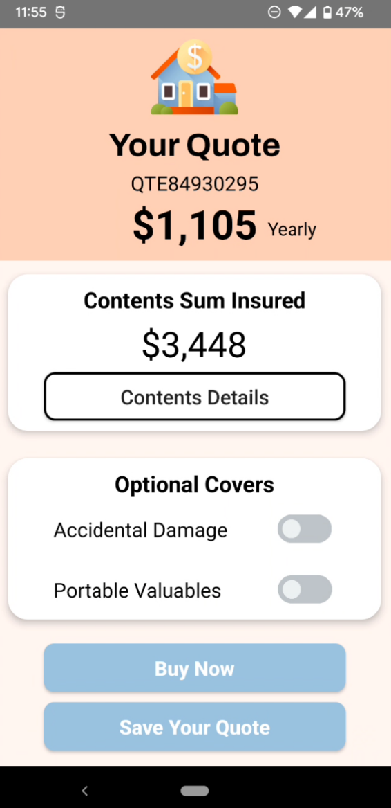
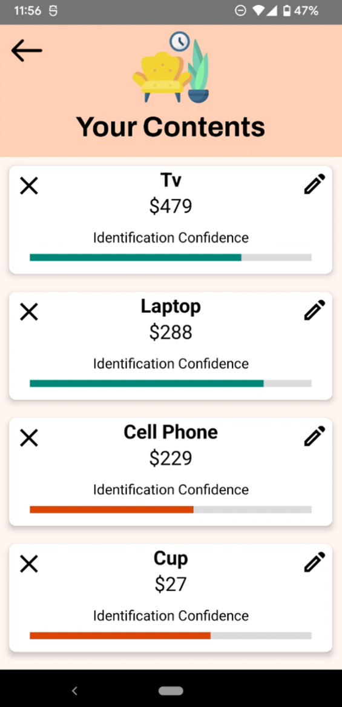

# Home Asset Assist

Home Asset Assist provides an easy and efficient solution for renters who struggle with accurately valuing their contents for insurance purposes. By leveraging machine learning, the app allows users to receive an accurate contents insurance quote in just 2 minutes—simply by walking around their home. Developed during a 48-hour hackathon, this app makes the process of getting insured quicker and more accessible for renters.

## Features

**AI-Powered Object Detection**: Uses TensorFlow to identify and classify household items.

**Quick Insurance Quotes**: Get an accurate contents insurance estimate in just 2 minutes.

**Seamless User Experience**: Walk through your home and let the app do the work.

**Efficient & Lightweight**: Optimized for fast processing on Android devices.

**Hackathon-Built**: Designed and developed in just 48 hours.

## Tech Stack

**Platform**: Android (Kotlin)

**Machine Learning**: TensorFlow (Object Detection)

## Screenshots

    
    
    
    

## Installation

1. Clone the repository: `git clone https://github.com/mhoppitt/home-asset-assist.git`

2. Open the project in Android Studio.

3. Build and run the app on an Android device or emulator.
